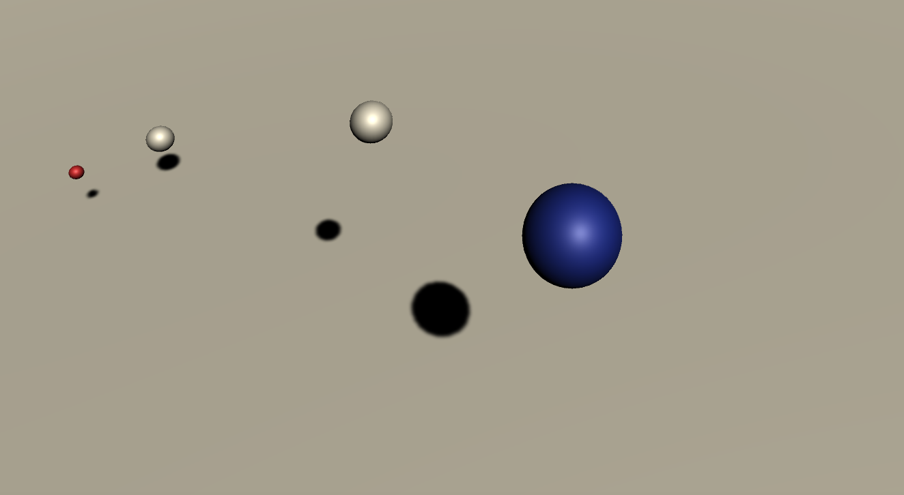

# Special-Relativity-Simulator
Special Relativity Simulator is an attempt to simulate the effects of Einstein's Theory of Special Relativity, using the Unity game engine (written in C#).

Currently, SRS provides an accurate model of time dialating relativistic effects on observers in inertial frames (i.e. observers are not accelerating)

Time is measured for each observer with their own "clock", which is manifested as a planetary system with orbital period of seconds.

Time is warped according to the following Lorentz tranformation, theorized by Dutch physicist Hendrik Lorentz:

In this model, the speed of light (c) has been vastly scaled down to 10 m/s to exaggerate effects.

This project is a work in progress, and there is a ton of room for improvement. The end goal is to simulate accurately the effects of general relativity, which will surely bring about much advanced calculus, but also some beautifully simple solutions. I'll get on this when I find the free time (over the holidays, surely). The following are to be implemented, in order of importance:
Length expansion/contraction to the style of lorentz transformations (still enveloped in special relativity)
Support for accelerating frames, which will involve some calculus and matrix algebra
Visual redshifting (via doppler effect and gravity)
Support for the notion of "freely falling frames" (aka introducing Gravity)

Gravity will bring about plenty of obstacles, so it's hard to say how far I can get past this. But here are some other ideas that would be interesting to test out:
Black Holes
Active planets
Multiplayer support
Scaled model of our solar system

