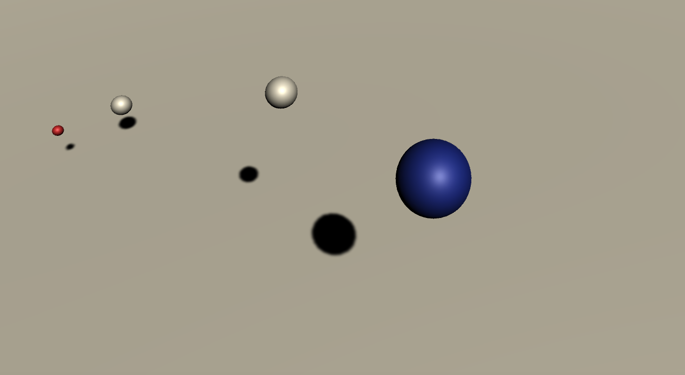

# Special-Relativity-Simulator
Special Relativity Simulator is an attempt to simulate the effects of Einstein's Theory of Special Relativity, using the Unity game engine (written in C#).

Currently, SRS provides an accurate model of time dialating relativistic effects on observers in inertial frames (i.e. observers are not accelerating)

Time is measured for each observer with their own "clock", which is manifested as a planetary system with orbital period of seconds.

Time is warped according to the following Lorentz tranformation, theorized by Dutch physicist Hendrik Lorentz:

